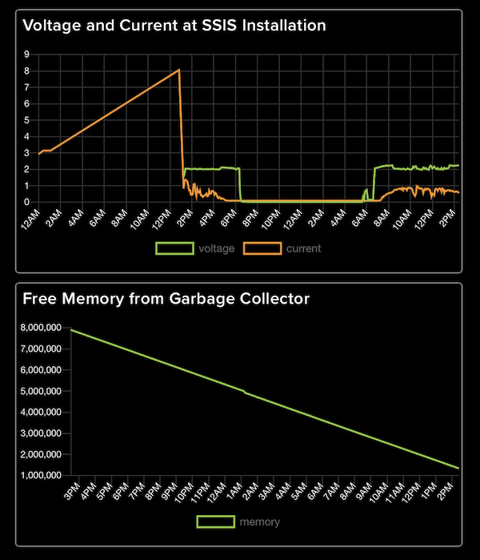
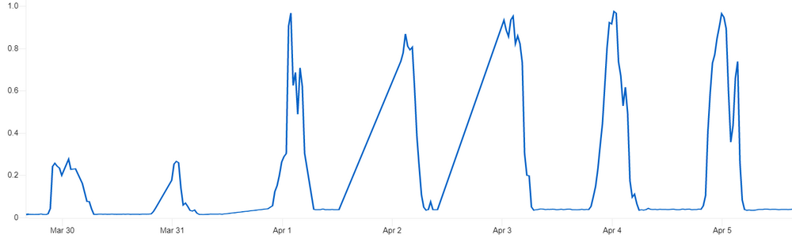
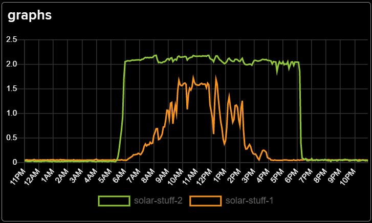
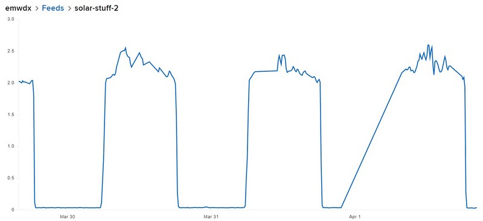
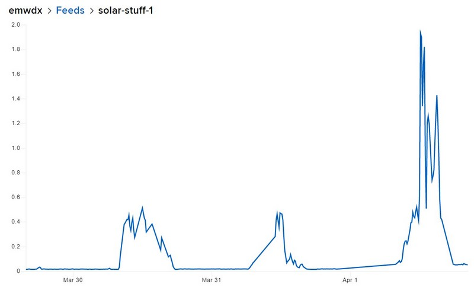
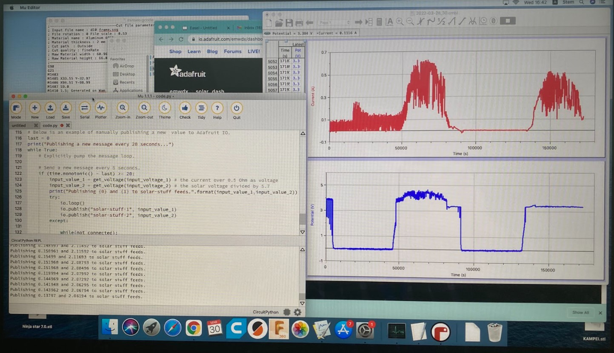

# ssisolar

Documentation of Photovoltaic Potential at SSIS

## Project description

We want to explore the potential and challenges of photovoltaic systems by creating and maintaining an example system. For further investigation we want to collect as much data as possible.

Here are some current feeds on the Adafruit IO MQTT platform:
- https://io.adafruit.com/emwdx/dashboards/solar-dash
- https://io.adafruit.com/emwdx/feeds/solar-stuff-2 for voltage
- https://io.adafruit.com/emwdx/feeds/solar-stuff-1 for current
- https://io.adafruit.com/kreier/dashboards/ssis-solar
- https://io.adafruit.com/kreier/feeds/voltage
- https://io.adafruit.com/kreier/feeds/current
- https://io.adafruit.com/kreier/feeds/memory

## History

### April 11th, 2022

Sometimes the connection to WIFI or Adafruit IO is not successfull on the first attempt. This might throw an error and abort the program. In `version 0.2` we put these requests into a `try:` - `except:` loop, but this causes another problem: The amount of free memory as measured by the garbage collector `gc.mem_free()` is constantly decreasing:

Without warning the submission over WIFI just stops, but does not throw an error. On the console (or TFT on T-Dislay) it documents the supposed submission, but no data reaches the MQTT broker. The current workaround after submitting our data every 20 seconds is to collect all garbage with `gc.collect()`.

### April 6th, 2022

The current measurement for the last 7 days still shows the changes made to code and setup:

- **March 30th** The current sensor was connected in the wrong direction and therefore provided with a negative voltage, which resulted in a constant zero reading. After changing in the morning, it started submitting positive data
- **March 31th** Lost connection in the morning. Restarted the Metro ESP32S2 during lunch and current measurement continued (linear jump in graph)
- **April 1st** To make the current better visible in the combined view we increased the scale by 3. For this example above it now represents the current in Ampere. This lead to the jump in current during the middle of the day.
- **April 2nd** In the night of April 1st the transmission stopped. We noticed during April 2nd and restarted the Microcontroller. Another linar jump between these to measurements.
- **April 3rd** After another 8 hours the transmission stopped again. We installed a second internet router right next to the microcontroller and found a memory leak when printing `gc.mem_free()` of about 1.5 kByte each transmission every 20 seconds. After 8 hours the free heap space of 2 MByte was used and the transmission stopped. Workaround: Call `gc.collect()` every 20 seconds.
- **April 4th** Our system works well, sunshine in the morning, then clouds and rain in the afternoon with significant reduced current output.
- **April 5th** The rainstorm in the afternoon was even larger, as our data collection documented.

### April 4th, 2022

The internet connection was fixed. But we created a memory leak of 1.5 kByte every submisssion (20 seconds) that stopped all transmissions after 8 hours when the 2 MByte heap was depleted. Workaround: call the garbage collector `gc.collect()` every 20 seconds. Now we collect continously data:

Here green is the voltage over the day and orange the current. Shorty after 12:00 PM clouds covered the sky and it started to rain, as recorded in this diagram. And it was relatively dark after 2:00 PM until the evening.

### April 1st, 2022

The internet connection is rather unstable or to far away for our ESP32S2. Restarting circuitpython with the REPL or reset starts the transmission, but the rendered graphs connects the last two values with a straight line, which might be confusing. Se the jump in  the voltage measurement (times 5.7) at the beginning of April first:

Another update involves the current measurement. With a peak current of 1.5 Ampere the reading would only be 0.75 Volt. Thats small compared to the peak raw voltage measurement of 2 Volt after the 1:5.7 voltage divider. So I multiply the measurement by 3 to give it a comparable range during the day for the combined plot.

### March 30th, 2022

Our first measurement with ESP32S2 and Adafruit IO, having voltage and current sensor running parallel. Combined the values of the last 24 hours are in [the dashboard](https://io.adafruit.com/emwdx/dashboards/solar-dash) but we have [voltage](https://io.adafruit.com/emwdx/feeds/solar-stuff-2) and [current](https://io.adafruit.com/emwdx/feeds/solar-stuff-1) individually too. First day (with lost connections and incomplete ssl handshakes) looks like this:

With Logger Pro from Vernier we collect current and voltage in parallel. To overcome the sensor limitations we attached the voltage probe (6 Volt max) to a 1:3 30kOhm voltage divider. And we added a 0.05 Ohm resistor parallel to the internal resistor of 0.1 Ohm of the 0.6 Amperemeter.

The picture above shows the data collection on our iMac from sunset __March 27th__ to sunset __March 29th__. The two syncronous positive periods in 🔵voltage and 🔴current are sunlight daytime March 28th and 29th. Two features stick out: 

- __Noise:__ With the addition of the Metro ESP32S2, connected via USB to the iMac for power, programming and REPL we also grounded the solar installation itself. The differential voltage and current meters from the Vernier LabQuest setup collected a lot of noise from the 30 long cable to the solar panel, that collected a lot of static noise over the distance. The setup was added in the afternoon of March 28th, as seen in the clear lower noise of the red current collection and the drop in measured blue voltage for the solar panel. It now matches the voltage of the battery.

- __Rain at 9:00 PM on March 27th:__ This Monday night a thunderstorm with heavy rain crossed over Saigon. This can be seen in the peak of __red current__ noise during the first night measurement. The voltage stays unaffected at zero.

The installation itself collects data since Friday, 2022-03-18.
