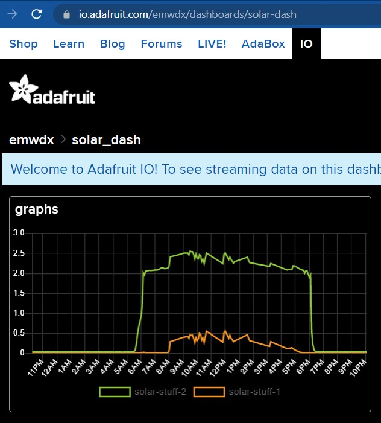

# ssisolar
Documentation of Photovoltaic Potential at SSIS

## Project description

We want to explore the potential and challenges of photovoltaic systems by creating and maintaining an example system. For further investigation we want to collect as much data as possible.

## History

### March 30th, 2022

Our first measurement with ESP32S2 and Adafruit IO, having voltage and current sensor running parallel. Combined the values of the last 24 hours are in [the dashboard](https://io.adafruit.com/emwdx/dashboards/solar-dash) but we have [voltage](https://io.adafruit.com/emwdx/feeds/solar-stuff-2) and [current](https://io.adafruit.com/emwdx/feeds/solar-stuff-1) individually too. First day (with lost connections and incomplete ssl handshakes) looks like this:

With Logger Pro from Vernier we collect current and voltage in parallel. To overcome the sensor limitations we attached the voltage probe (6 Volt max) to a 1:3 30kOhm voltage divider. And we added a 0.05 Ohm resistor parallel to the internal resistor of 0.1 Ohm of the 0.6 Amperemeter.

More to follow.
